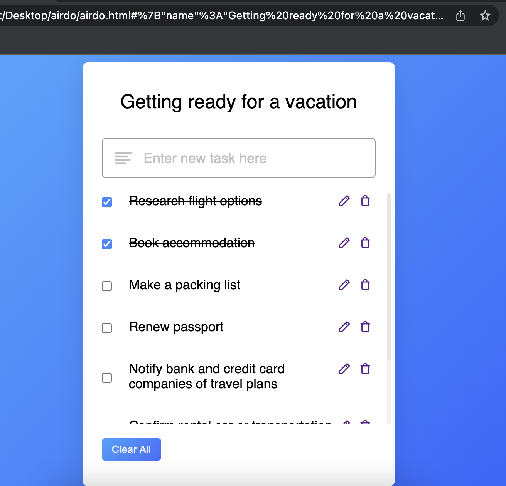

# airdo

AirDo is a simple Todo "app" that uses the URL to persistently store its state.
It was made for people like me who have multiple browser windows open, each related to 
an area of responsibility, and want to keep track of short term tactical tasks 
related to each window without having to switch away from the browser. 

This was also built around the time ChatGPT became availble, and I used this as an
experiment to see how helpful it could be at generating code. The answer: it's complicated. 

Most CSS styling borrowed from the following example project: 
https://www.codingnepalweb.com/create-todo-list-app-html-javascript/
